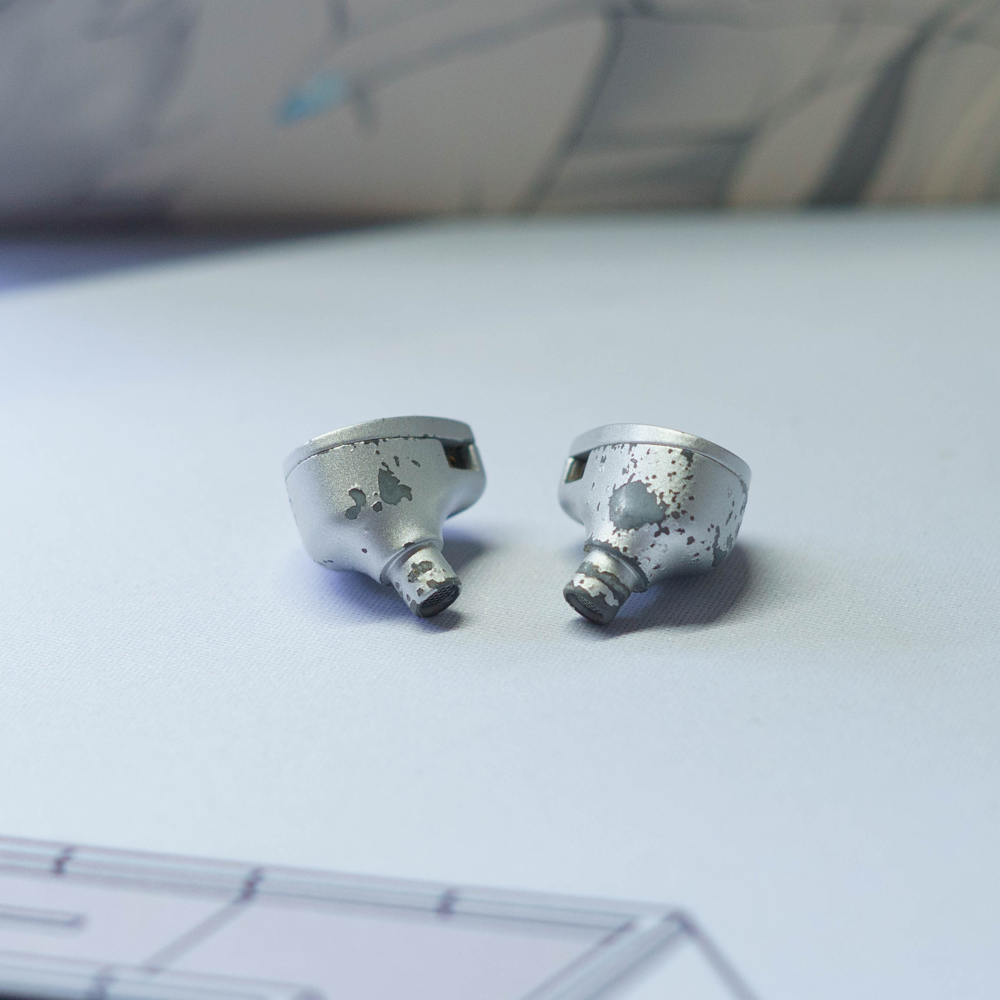
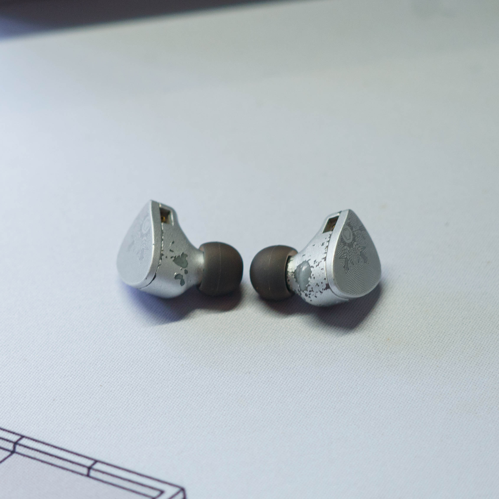
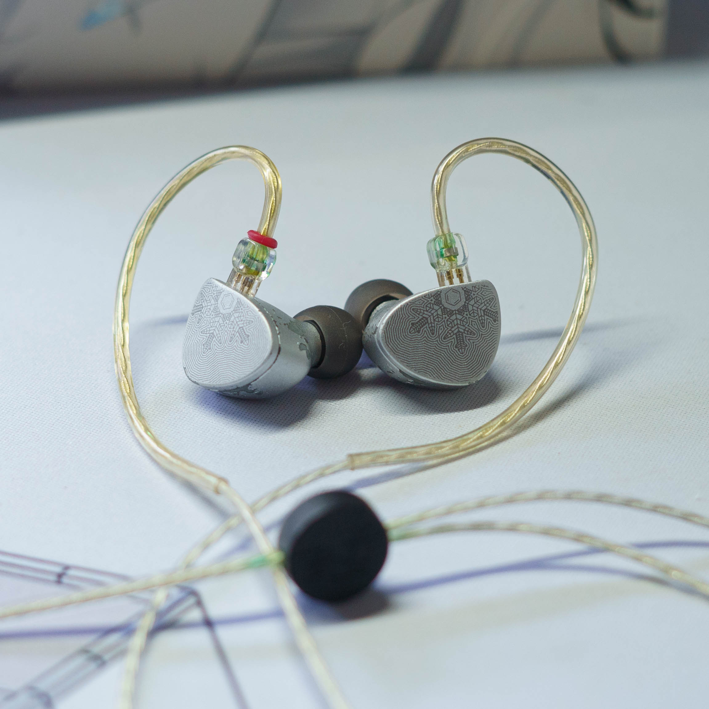
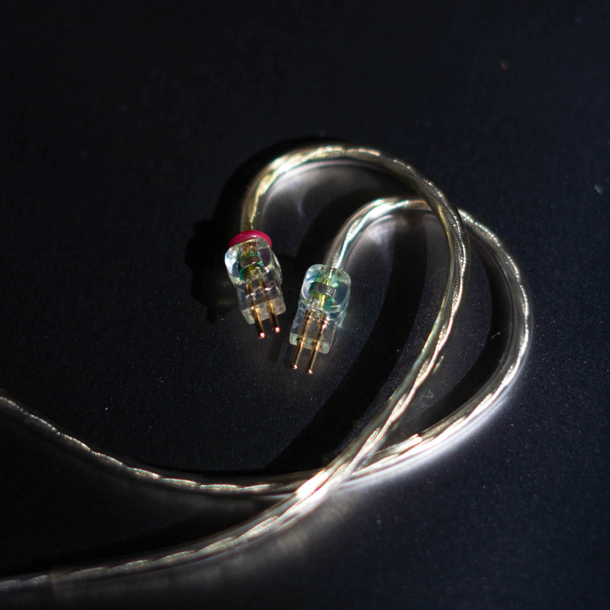
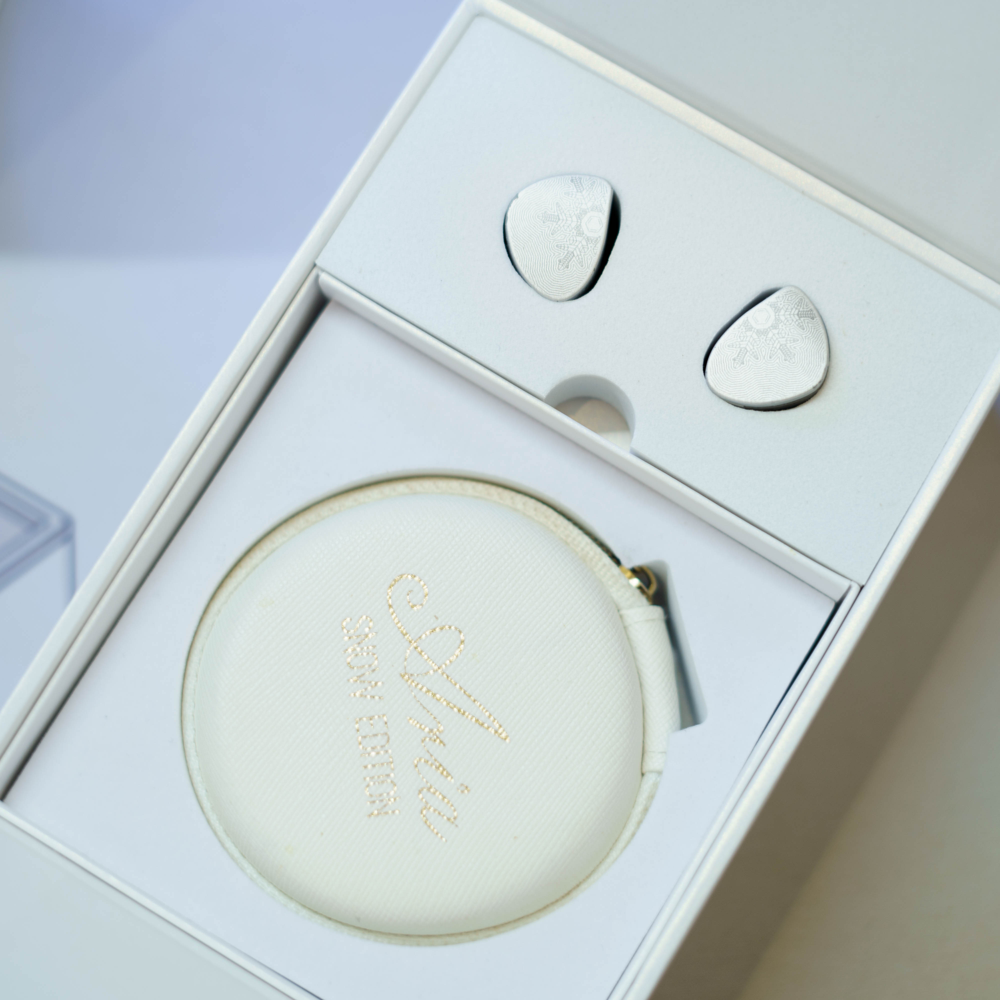
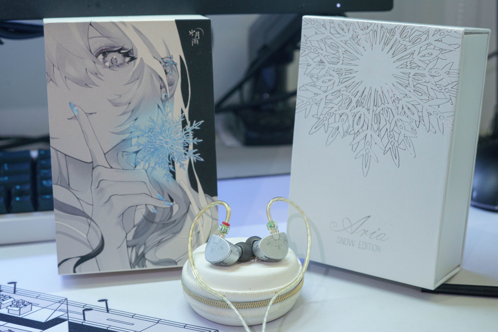
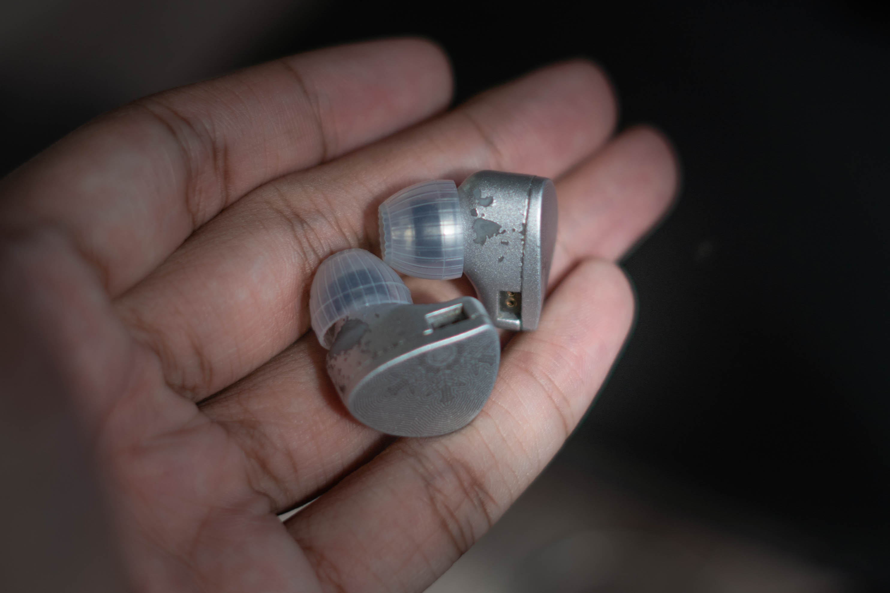

<!DOCTYPE html>
<html lang="en">

<head>
  <meta charset="utf-8">
  <meta content="width=device-width, initial-scale=1.0" name="viewport">

  <title>Moondrop Aria Snow Letgo</title>
  <meta content="" name="description">
  <meta content="" name="keywords">

  <!-- Favicons -->
  <link href="assets/img/favicon.png" rel="icon">
  <link href="assets/img/apple-touch-icon.png" rel="apple-touch-icon">

  <!-- Google Fonts -->
  <link href="https://fonts.googleapis.com/css?family=Open+Sans:300,300i,400,400i,600,600i,700,700i|Raleway:300,300i,400,400i,500,500i,600,600i,700,700i|Poppins:300,300i,400,400i,500,500i,600,600i,700,700i" rel="stylesheet">

  <!-- Vendor CSS Files -->
  <link href="assets/vendor/aos/aos.css" rel="stylesheet">
  <link rel="stylesheet" href="https://www.w3schools.com/w3css/4/w3.css">
  <link href="assets/vendor/bootstrap/css/bootstrap.min.css" rel="stylesheet">
  <link href="assets/vendor/bootstrap-icons/bootstrap-icons.css" rel="stylesheet">
  <link href="assets/vendor/boxicons/css/boxicons.min.css" rel="stylesheet">
  <link href="assets/vendor/glightbox/css/glightbox.min.css" rel="stylesheet">
  <link href="assets/vendor/swiper/swiper-bundle.min.css" rel="stylesheet">

  <!-- Template Main CSS File -->
  <link href="assets/css/style.css" rel="stylesheet">
</head>

<body>

  <!-- ======= Mobile nav toggle button ======= -->
  <i class="bi bi-list mobile-nav-toggle d-xl-none"></i>

  <!-- ======= Header ======= -->
  <header id="header">
    

      

        
        <h1 class="text-light"><a href="">Haziq Mishhak</a></h1>
        
        
      

    

  </header><!-- End Header -->

  <main id="main">

    <!-- ======= Portfolio Section ======= -->
    <section id="portfolio" class="portfolio section-bg">
      

        

          <h2>Moondrop Aria Snow Edition IEM </h2>
          <h4>IEM Description</h4>
          
<em>I am selling my Moondrop Aria Snow Edition for <b>RM150 (can nego)</b>. These IEMs have been heavily used for 2+ years but remain in excellent working condition with no 
            issues apart from cosmetic paint chipping, which is a known factory issue related to the 
            paint material used.</em>

            
<b>Reason selling:</b> has new one (buat semak nak simpan)

            
<a href="https://www.reddit.com/r/headphones/comments/wmw7mr/in_case_anyone_was_wondering_the_aria_snow/">Reddit post about paint issues</a>

           
          
<b>Aria Snow, sound tuning details</b>

          <ul>
            <li>Moondrop Aria Snow features a unique tuning that deviates from typical V-shaped 
                frequency response. It offers a balanced sound signature with detailed 
                midrange and treble, suitable for audiophiles and enthusiasts who appreciate 
                clarity and accuracy in sound reproduction.</li>
            <li>When you first use this IEM, you might notice a lack of bass. This is due to its neutral and balanced sound signature,
                 which prioritizes vocals and instruments over bass emphasis.</li>
          </ul>
          
Below is the Hi-Res Image of the IEM ( Box is included with the IEM,) <b>Come with Unused Moondrop Spring Tip</b>
          

        

        

          

            

              
              

                <a href="assets/img/aria/3.jpg" data-gallery="portfolioGallery" class="portfolio-lightbox"><i class="bx bx-plus"></i></a>
              

            

          

          

            

              
              

                <a href="assets/img/aria/4.jpg" data-gallery="portfolioGallery" class="portfolio-lightbox"><i class="bx bx-plus"></i></a>
              

            

          

        

        

          

            

              
              

                <a href="assets/img/aria/5.jpg" data-gallery="portfolioGallery" class="portfolio-lightbox"><i class="bx bx-plus"></i></a>
              

            

          

          

            

              
              

                <a href="assets/img/aria/6.jpg" data-gallery="portfolioGallery" class="portfolio-lightbox"><i class="bx bx-plus"></i></a>
              

            

          

        

        

            

              

                
                

                  <a href="assets/img/aria/1.jpg" data-gallery="portfolioGallery" class="portfolio-lightbox"><i class="bx bx-plus"></i></a>
                

              

            

  
            

              

                
                

                  <a href="assets/img/aria/8.jpg" data-gallery="portfolioGallery" class="portfolio-lightbox"><i class="bx bx-plus"></i></a>
                

              

            

          

          

            

              

                
                

                  <a href="assets/img/aria/7.jpg" data-gallery="portfolioGallery" class="portfolio-lightbox"><i class="bx bx-plus"></i></a>
                

              

            

  
            

              

                
                

                  <a href="assets/img/aria/2.jpg" data-gallery="portfolioGallery" class="portfolio-lightbox"><i class="bx bx-plus"></i></a>
                

              

            

          

      

    </section><!-- End Portfolio Section -->

    

  </main><!-- End #main -->

  <!-- ======= Footer ======= -->
  <footer id="footer">
    

      

        Developed by <a href="https://instagram.com/haziqmishhak?igshid=OGQ5ZDc2ODk2ZA%3D%3D&utm_source=qr">HaziqMishhak</a>
      

    

  </footer><!-- End  Footer -->

  <a href="#" class="back-to-top d-flex align-items-center justify-content-center"><i class="bi bi-arrow-up-short"></i></a>

  <!-- Vendor JS Files -->
  
  
  
  
  
  
  
  
  

  <!-- Template Main JS File -->
  

</body>

</html>
